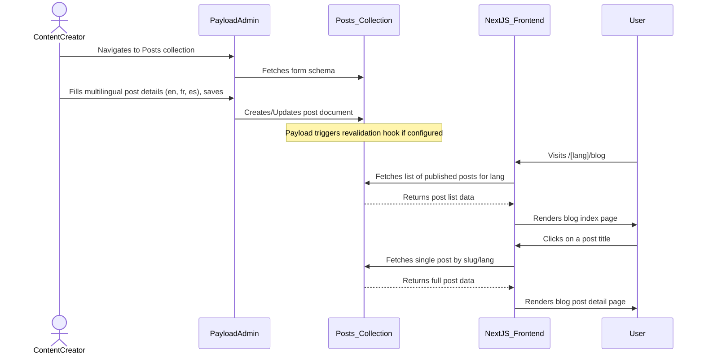
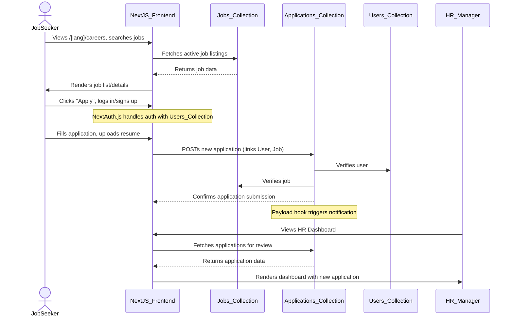

# Technical Design: Architecture Overview

### Document Information
*   **Design ID:** TD-ARCH-001
*   **Project:** PayloadCMS Blog & Job Portal
*   **Version:** 1.0
*   **Author:** Architect (bmad-architect)
*   **Date:** August 26, 2025
*   **Status:** Draft

---

### 1. Introduction

This document provides a high-level technical architecture for the integration of a Company Blog and a Company Job Portal into the existing Next.js and PayloadCMS monorepo. The design prioritizes leveraging existing infrastructure, maintaining consistency, and ensuring scalability and maintainability.

---

### 2. High-Level System Diagram

```mermaid
graph TD
    subgraph "User Browser"
        A[User]
    end

    subgraph "Next.js Frontend (Vercel/Hosting)"
        B[Next.js App Router]
        C[Public Pages: /[lang]/blog, /[lang]/careers]
        D[Protected Pages: /dashboard/*]
        E[Shadcn UI Components]
        F[NextAuth.js]
    end

    subgraph "PayloadCMS Backend (Self-Hosted/Cloud)"
        G[PayloadCMS API (REST/GraphQL)]
        H[Payload Admin UI]
        I[(MongoDB Database)]
        J[Posts Collection]
        K[Jobs Collection]
        L[Applications Collection]
        M[Users Collection (Extended)]
        N[Media Collection]
        O[Other Existing Collections]
    end

    subgraph "External Services"
        P[S3 Cloud Storage]
        Q[Email Service (e.g., SendGrid, Resend)]
    end

    A --> B
    B --> C
    B --> D
    B --> E
    B --> F

    C --> G
    D --> G
    F --> G

    G --> J
    G --> K
    G --> L
    G --> M
    G --> N
    G --> O

    H --> G
    H --> J
    H --> K
    H --> L
    H --> M

    J --> I
    K --> I
    L --> I
    M --> I
    N --> I
    O --> I

    G -- Media Uploads --> P
    G -- Notifications --> Q
```

---

### 3. Sharding Strategy

The project is broken down into logical, manageable "shards" to separate concerns and allow for parallel development and deployment. Each shard has a distinct responsibility.

#### 3.1. Core Philosophy
The sharding strategy is based on a combination of feature domains (Blog vs. Job Portal) and application layers (CMS vs. Frontend). Shared infrastructure (like Users and Media) is centralized to avoid duplication and ensure consistency.

#### 3.2. Key Shards

*   **`shared-infrastructure`**: This is not a code module but a conceptual shard encompassing all shared services and configurations.
    *   **Payload Core:** The main PayloadCMS instance, database connection, and base configuration.
    *   **`Users` Collection:** Extended to support all user types required by both the Blog (Authors) and Job Portal (Job Seekers, HR, Hiring Managers, Admins).
    *   **`Media` Collection:** Used by both Blog (featured images, inline media) and Job Portal (company logos, candidate resumes).
    *   **Authentication:** NextAuth.js integration with the Payload `Users` collection for session management across the entire application.
    *   **UI Theme (Shadcn):** A shared library of Shadcn UI components, styled with global theme variables (CSS custom properties) to ensure visual consistency.

*   **`blog-cms`**
    *   **Responsibility:** Manages all data and logic related to blog content within PayloadCMS.
    *   **Key Components:**
        *   `Posts` Collection: Schema for blog posts, including localized fields for `title`, `slug`, `content`, `excerpt`.
        *   Payload Admin UI customizations for the `Posts` collection.
        *   Access control logic for blog content creation and management.
    *   **Dependencies:** `shared-infrastructure` (Users, Media).

*   **`blog-frontend`**
    *   **Responsibility:** All user-facing frontend components and pages for the blog.
    *   **Key Components:**
        *   Next.js pages: `src/app/[lang]/blog/page.tsx`, `src/app/[lang]/blog/[slug]/page.tsx`.
        *   React components: `BlogPostCard.tsx`, `BlogPostDetail.tsx`, `BlogSearch.tsx`, `AuthorBio.tsx`.
        *   Data fetching logic using Payload's API.
        *   Rich text rendering component.
    *   **Dependencies:** `shared-infrastructure` (UI Theme, Authentication), `blog-cms` (via API).

*   **`job-portal-cms`**
    *   **Responsibility:** Manages all data and logic related to the job portal within PayloadCMS.
    *   **Key Components:**
        *   `Jobs` Collection: Schema for job listings.
        *   `Applications` Collection: Schema for job applications, linking Users and Jobs.
        *   `ApplicationStatusLogs` Collection: For audit trails.
        *   Payload Admin UI customizations for job portal collections.
        *   Access control logic based on user roles (HR, Hiring Manager, Admin).
        *   Payload Hooks for notifications and audit logging.
    *   **Dependencies:** `shared-infrastructure` (Users, Media).

*   **`job-portal-frontend`**
    *   **Responsibility:** All user-facing and internal (dashboard) frontend components and pages for the job portal.
    *   **Key Components:**
        *   Next.js pages: `src/app/careers/page.tsx`, `src/app/careers/[slug]/page.tsx`, `src/app/dashboard/...`.
        *   React components: `JobCard.tsx`, `JobDetail.tsx`, `ApplicationForm.tsx`, `DashboardHR.tsx`, `DashboardHiringManager.tsx`.
        *   Data fetching logic using Payload's API.
        *   File upload component for resumes.
    *   **Dependencies:** `shared-infrastructure` (UI Theme, Authentication), `job-portal-cms` (via API).

---

### 4. Data Flow Diagrams

#### 4.1. Blog Post Creation & Viewing Flow



#### 4.2. Job Application Submission Flow



---

### 5. Technology Choices & Justification

| Technology | Justification |
| :--- | :--- |
| **Next.js 14 (App Router)** | **Existing Standard.** Provides excellent developer experience, server-side rendering (SSR), static site generation (SSG), and API routes. The App Router offers a more intuitive file-based routing system and improved data fetching patterns, which align perfectly with our needs for the blog and job portal. |
| **PayloadCMS** | **Existing Standard.** A headless CMS built on Node.js and MongoDB. Its self-hostable nature, TypeScript-first approach, and extensible plugin system make it a perfect fit for our technical stack and requirements. It provides a powerful admin UI for content managers. |
| **MongoDB** | **Existing Standard.** A NoSQL database that pairs naturally with PayloadCMS. Its flexible document model is well-suited for the varied data structures of blog posts and job applications. |
| **NextAuth.js** | **Existing Standard.** A complete authentication solution for Next.js applications. It will be used to handle user sessions, integrate with the Payload `Users` collection, and protect dashboard routes. |
| **Shadcn UI** | **Existing Standard.** A collection of re-usable, accessible, and customizable React components. Using Shadcn ensures UI consistency, speeds up development, and leverages the existing theme system. |
| **Tailwind CSS** | **Existing Standard.** A utility-first CSS framework that works seamlessly with Shadcn UI and allows for rapid, custom styling while maintaining a consistent design system. |
| **S3 Cloud Storage** | **Existing Standard.** Used by PayloadCMS for storing media files (images, resumes). It provides a scalable and durable solution for file storage. |
| **SendGrid/Resend** | **Proposed Standard.** For sending transactional emails (e.g., application confirmations, status updates). The choice between them can be made based on specific feature needs and pricing. |

---

### 6. Additional Considerations

Beyond the core architectural and design decisions, several other factors are critical for the success and longevity of the project.

#### 6.1. Security

*   **Environment Variables:** All sensitive information (database connection strings, API keys, JWT secrets, revalidation secrets) must be stored as environment variables and never hardcoded in the application. A `.env.example` file should be provided to document required variables.
*   **API Rate Limiting:** Implement rate limiting on public-facing API endpoints (e.g., login, registration, public job listings) to prevent abuse and brute-force attacks. This can be achieved at the Next.js level (middleware) or via a reverse proxy (e.g., Nginx).
*   **Input Validation & Sanitization:** All user input, both on the client and server side, must be rigorously validated and sanitized. PayloadCMS provides built-in validation, but custom API routes require careful handling. Libraries like `zod` can be used for schema validation in Next.js API routes.
*   **HTTPS:** Ensure the entire application is served over HTTPS to encrypt data in transit. This is standard practice with modern hosting providers like Vercel.
*   **Content Security Policy (CSP):** Implement a CSP to mitigate cross-site scripting (XSS) and other injection attacks. This can be configured via Next.js headers.
*   **Payload Security Best Practices:** Adhere to PayloadCMS's security recommendations, including proper configuration of access control, use of their built-in sanitization for rich text, and keeping the PayloadCMS version up to date.

#### 6.2. Performance

*   **Image Optimization:** Leverage Next.js's built-in `Image` component for automatic image optimization, resizing, and serving in modern formats (WebP/AVIF). This is crucial for blog featured images and company logos.
*   **Database Indexing:** Ensure that frequently queried fields in MongoDB (e.g., `posts.slug`, `posts.status`, `jobs.slug`, `jobs.status`, `applications.applicant`, `applications.job`) are properly indexed to optimize query performance. PayloadCMS provides some default indexing, but custom indexes may be needed for complex queries.
*   **Caching Strategy:**
    *   **Data Caching:** Utilize Next.js's caching mechanisms (`fetch` cache, `unstable_cache`) for frequently accessed, non-dynamic data from PayloadCMS.
    *   **Full-Page Caching:** For public pages like the blog index or job listings, consider using Incremental Static Regeneration (ISR) with a suitable revalidation interval to balance freshness with performance.
*   **Code Splitting:** Next.js automatically performs code splitting. Ensure dynamic imports are used for large components or libraries that are not immediately needed on the initial page load.
*   **Bundle Size Analysis:** Regularly analyze the JavaScript bundle size to identify and remove large or unused dependencies.

#### 6.3. Monitoring & Error Handling

*   **Error Tracking:** Integrate an error tracking service (e.g., Sentry, Datadog) to capture and report runtime errors from both the Next.js frontend and the PayloadCMS backend. This is invaluable for debugging issues in production.
*   **Logging:** Implement structured logging in both Next.js (for API routes, server actions) and PayloadCMS (using its built-in logger). Logs should be centralized for easy analysis.
*   **Performance Monitoring:** Use tools like Vercel Analytics, Web Vitals, or Lighthouse to monitor frontend performance. For the backend, monitor PayloadCMS API response times and database query performance.
*   **Uptime Monitoring:** Set up external uptime monitoring to get alerted if the application becomes unavailable.

#### 6.4. Deployment & DevOps

*   **CI/CD Pipeline:** Establish a robust CI/CD pipeline (e.g., using GitHub Actions) to automate testing, linting, and deployment of both the Next.js frontend and the PayloadCMS backend upon merging to the main branch.
*   **Database Migrations:** PayloadCMS handles its own database schema changes. However, for any direct database modifications or complex data migrations, a clear strategy and tooling (e.g., custom scripts) should be in place.
*   **Backup Strategy:** Implement a regular, automated backup strategy for the MongoDB database. Most cloud database providers offer this feature.
*   **Environment Management:** Maintain separate environments (development, staging, production) with their own configurations and databases. The CI/CD pipeline should facilitate deployments to staging for final review before production.

#### 6.5. Accessibility (a11y)

*   **Semantic HTML:** Ensure all HTML is semantic. This is generally well-handled by using modern React and Next.js practices.
*   **ARIA Attributes:** Use ARIA attributes correctly to enhance accessibility for dynamic content and complex UI components, especially within the admin dashboard and custom forms.
*   **Keyboard Navigation:** Ensure all interactive elements are fully navigable and operable using only a keyboard.
*   **Color Contrast:** Adhere to WCAG guidelines for color contrast to ensure text is readable for users with visual impairments. The existing Shadcn theme should be checked for compliance.
*   **Testing:** Regularly test the application using screen readers (e.g., NVDA, VoiceOver) and automated accessibility testing tools (e.g., axe DevTools).

#### 6.6. Future Scalability & Extensibility

*   **Microservices Architecture (Long-term):** While the current monorepo structure is suitable for now, consider if certain parts of the application (e.g., a complex reporting engine) might benefit from being broken out into separate microservices in the future.
*   **API Versioning:** If the PayloadCMS API is to be consumed by other clients besides the Next.js frontend, implement API versioning from the start to avoid breaking changes.
*   **Plugin Architecture:** Leverage PayloadCMS's plugin system for extending functionality. Custom features should be developed as plugins where appropriate to keep the core clean and maintainable.
*   **Headless CMS for Other Frontends:** The headless nature of PayloadCMS allows for other frontends (e.g., a mobile app) to consume the same content and data in the future without modifying the backend.