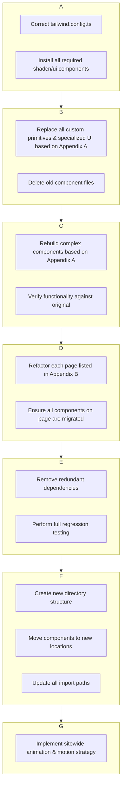

# Comprehensive Shadcn/ui Migration Strategy

## 1. Executive Summary

This document presents a detailed, research-driven strategy for migrating the project's component library to `shadcn/ui`. A thorough analysis of the codebase reveals that a successful migration is highly feasible and will standardize the UI layer. The project's architecture, particularly its use of "Wrapper Components" for i18n and data management, is a significant asset that will simplify the migration process.

This updated plan now includes a full component audit, a page-level migration plan, and a detailed analysis of the i18n architecture, ensuring every component and page is accounted for.

## 2. Architectural Analysis & Key Findings

### 2.1. Component Categorization
The `src/components` directory can be broken down into four distinct categories, each requiring a different migration approach:

*   **Custom UI Primitives**: Simple, foundational components.
    *   **Strategy**: Direct replacement with `shadcn/ui` primitives.
*   **Complex Presentational Components**: Large, multi-element components that form entire page sections.
    *   **Strategy**: Rebuild internals using `shadcn/ui` as building blocks.
*   **Wrapper Components**: Components ending in `...Wrapper.tsx` that provide data and context.
    *   **Strategy**: Do not modify.
*   **Specialized UI Components**: Highly stylized, often animated components found in `src/components/ui`.
    *   **Strategy**: Replace with `shadcn/ui` equivalents or other approved libraries where possible.

### 2.2. Theming
The project's theme system is fully compatible with `shadcn/ui`'s CSS variable-based approach and requires only a minor configuration tweak.

### 2.3. Internationalization (i18n) Architecture
The i18n system is robust and fully decoupled from the UI layer, posing no risk to the migration. This is due to a clean separation of concerns:

*   **Middleware-Based Routing**: The Next.js middleware (`src/middleware.ts`) handles all locale detection and routing *before* any page is rendered. It uses `Negotiator` and `@formatjs/intl-localematcher` to determine the correct language from the URL or headers.
*   **Context-Based Injection**: "Wrapper Components" (e.g., `AboutHeroWrapper.tsx`) receive the `locale` and `messages` as props from the server-rendered page. They use the `<IntlProvider>` from `react-intl` to make translations available to the entire component tree below them.
*   **Decoupled UI Components**: The actual UI components are consumers of this context. They use the `<FormattedMessage />` component or the `useIntl` hook to display translated text. They have no direct dependency on the i18n implementation itself.

**Conclusion**: Because the UI components are completely decoupled from the i18n logic, we can replace or rebuild them with `shadcn/ui` components without any risk to the internationalization system.

## 3. Detailed Migration Strategy

The migration will be executed in six distinct phases to ensure a structured and low-risk process.



## 4. Implementation Plan

### Phase 1-5: (As previously defined)
*These phases cover the initial setup, replacement of primitives, rebuilding of complex components, page-by-page refactoring, and cleanup of dependencies.*

### Phase 6: Post-Migration Component Reorganization
After the migration is functionally complete, the final step is to reorganize the `src/components` directory for better long-term maintainability. The proposed structure is:
```
src/components/
├── ui/          # For shadcn/ui and other UI primitives.
├── layouts/     # For major page structure (Navbar, Footer, Sidebar).
├── features/    # For components tied to specific business domains.
│   ├── about/
│   ├── products/
│   └── government/
└── shared/      # For common, reusable components (Logo, Spinner).
```

---

## 5. Quality Gates & Production Readiness

This section outlines the critical quality, performance, and experience standards that must be met throughout the migration to ensure a successful, production-grade rollout.

### 5.1. Accessibility & A11Y
*   **Verification**: All `shadcn/ui` components must be verified against WCAG 2.1 AA standards for color-contrast, focus order, and ARIA attributes.
*   **Auditing**: Each migrated page will be audited using automated tools (e.g., axe, Lighthouse) and manual keyboard navigation checks.

### 5.2. Testing Strategy & CI
*   **Test Suite**: A comprehensive testing strategy will be implemented:
    *   **Unit/Integration**: `Vitest` for component-level logic.
    *   **E2E**: `Playwright` for critical user flows on migrated pages.
    *   **Visual Regression**: `Storybook` snapshots and/or `Percy` to catch unintended visual changes.
*   **CI Pipeline**: A GitHub Actions workflow will be established to run the full test suite (build, lint, type-check, tests, visual diffs) on every pull request targeting `main`.

### 5.3. Design Tokens & Theming Alignment
*   **Token Coverage**: A full audit will ensure all brand design tokens (colors, spacing, typography, radii, motion) are mapped to CSS variables in `globals.css`.
*   **Theme Verification**: The light/dark mode toggle, `prefers-color-scheme` media query fallbacks, and dynamic theme persistence will be tested across all migrated components.
*   **Typography**: The theme will be configured to use `Instrument Serif` for all headings (via the `--font-serif` variable) and `Inter Tight` for all body text (via the `--font-sans` variable), ensuring consistent typography across the application.

### 5.4. Performance & Bundle Size
*   **Tree-Shaking**: The bundle size impact will be analyzed to ensure `shadcn/ui` primitives are being properly tree-shaken.
*   **Dynamic Imports**: For performance-critical pages with heavy components (e.g., carousels, data grids), `next/dynamic` will be used for code-splitting.

### 5.5. Component Deprecation & Rollout Strategy
*   **Staged Rollout**: Feature flags (e.g., using `framer-motion`'s `AnimatePresence` or a dedicated library) will be used to enable the new UI on a page-by-page or component-by-component basis, allowing for a controlled release.
*   **Deprecation Process**: Old components will coexist with new ones until QA sign-off for a given page is complete. A final "pruning" phase will remove all deprecated code.

### 5.6. Internationalization (i18n) Edge Cases
*   **Comprehensive Testing**: i18n testing will go beyond simple text replacement to include:
    *   Pluralization rules (`react-intl`'s `FormattedMessage` with `values` prop).
    *   Right-to-Left (RTL) layout integrity if applicable.
    *   Date, time, and number formatting for all supported locales.
*   **Hydration Matching**: We will verify that there is no "flash of untranslated content" (FOUT) and that client-side hydration perfectly matches the server-rendered output for all locales.

### 5.7. Error Handling & Boundaries
*   **Error Boundaries**: All complex, rebuilt components and page-level components will be wrapped in React Error Boundaries to prevent a single component failure from crashing the entire page.
*   **Fallback UIs**: Simple, static fallback UIs will be designed for critical components in the event of an error.

### 5.8. Developer Experience & Documentation
*   **Component Library**: The internal Storybook will be updated to include all new `shadcn/ui` components, with controls to test different variants and states.
*   **Migration Guide**: A brief document will be created outlining migration conventions (naming, folder structure, props patterns) for team alignment.

### 5.9. SEO & SSR Considerations
*   **SSR Verification**: We will ensure that replacing components does not negatively impact Server-Side Rendering. The output of `curl` or "View Source" will be inspected for critical pages.
*   **SEO Audits**: Google Lighthouse SEO audits will be run on migrated pages to check for regressions in metadata, crawlability, and core web vitals.

---

## 6. Appendix A: Exhaustive Component Audit & Migration Plan

This section provides the definitive, file-by-file inventory of all components and their migration strategies.

| Component Path | Category | Migration Strategy | Proposed Replacement |
| :--- | :--- | :--- | :--- |
| `AboutAwards.tsx` | Complex Presentational | Rebuild | CSS Grid + `Card` |
| `AboutAwardsWrapper.tsx` | Wrapper | Do Not Touch | N/A |
| `AboutCertifications.tsx` | Complex Presentational | Rebuild | CSS Grid + `Card` |
| `AboutCertificationsWrapper.tsx` | Wrapper | Do Not Touch | N/A |
| `AboutHero.tsx` | Complex Presentational | Rebuild | `Card`, `Button`, Typography |
| `AboutHeroWrapper.tsx` | Wrapper | Do Not Touch | N/A |
| `AboutPartnerNetwork.tsx` | Complex Presentational | Rebuild | CSS Grid + `Card` |
| `AboutPartnerNetworkWrapper.tsx` | Wrapper | Do Not Touch | N/A |
| `AboutStats.tsx` | Complex Presentational | Rebuild | Typography, Grid |
| `AboutStatsWrapper.tsx` | Wrapper | Do Not Touch | N/A |
| `AnimatedBackground.tsx` | Specialized UI | Defer to Animation Phase | Framer Motion / Keep |
| `Card.tsx` | Custom UI Primitive | Replace | `shadcn/ui Card` |
| `CardBody.tsx` | Custom UI Primitive | Delete | Part of `Card.tsx` |
| `CardHeader.tsx` | Custom UI Primitive | Delete | Part of `Card.tsx` |
| `ComplianceCarousel.tsx` | Complex Presentational | Rebuild | `shadcn/ui Carousel` |
| `ComplianceCarouselWrapper.tsx` | Wrapper | Do Not Touch | N/A |
| `Footer.tsx` | Complex Presentational | Rebuild | Typography, Grid, `Button` |
| `FooterWrapper.tsx` | Wrapper | Do Not Touch | N/A |
| `GovernmentHero.tsx` | Complex Presentational | Rebuild | `Card`, `Button`, Typography |
| `GovernmentHeroWrapper.tsx` | Wrapper | Do Not Touch | N/A |
| `Hero.tsx` | Complex Presentational | Rebuild | `Card`, `Button`, Typography |
| `HeroWrapper.tsx` | Wrapper | Do Not Touch | N/A |
| `Navbar.tsx` | Complex Presentational | Rebuild | `shadcn/ui NavigationMenu` |
| `ProductsBentoGrid.tsx` | Complex Presentational | Rebuild | CSS Grid + `shadcn/ui Card` |
| `ProductsBentoGridWrapper.tsx` | Wrapper | Do Not Touch | N/A |
| `Products...Features.tsx` (All) | Complex Presentational | Rebuild | `Card`, `Accordion`, Typography |
| `ScrollToTopButton.tsx` | Specialized UI | Replace | `shadcn/ui Button` |
| `Sidebar.tsx` | Complex Presentational | Rebuild | `shadcn/ui Sheet` |
| `Spinner.tsx` | Specialized UI | Replace | `lucide-react` icon |
| `ThemeToggle.tsx` | Specialized UI | Replace | `shadcn/ui Button` + `DropdownMenu` |
| `ui/apple-cards-carousel.tsx` | Specialized UI | Replace | `shadcn/ui Carousel` |
| `ui/bento-grid.tsx` | Specialized UI | Replace | CSS Grid + `shadcn/ui Card` |
| `ui/button.tsx` | shadcn/ui | Verify Usage | N/A |
| `ui/card.tsx` | shadcn/ui | Verify Usage | N/A |
| `ui/floating-navbar.tsx` | Specialized UI | Replace | Rebuild with `shadcn/ui NavigationMenu` |
| `ui/globe.tsx` | Specialized UI | Defer to Animation Phase | Framer Motion / Keep |
| `ui/glowing-stars.tsx` | Specialized UI | Defer to Animation Phase | Framer Motion / Keep |
| `ui/infinite-moving-cards.tsx` | Specialized UI | Replace | `shadcn/ui Carousel` |
| `ui/meteors.tsx` | Specialized UI | Defer to Animation Phase | Framer Motion / Keep |

---

## 7. Appendix B: Page-Level Migration Plan

This section, derived from the `COMPLETE_SITE_MAP.md`, outlines the pages to be refactored. The migration will proceed in the order of priority defined below.

### Phase 1: Critical Pages (P0)

| Page | Route Pattern | Key Components to Refactor |
| :--- | :--- | :--- |
| **Homepage** | `/{lang}` | `Hero.tsx`, `ProductsBentoGrid.tsx` |
| **About** | `/{lang}/about` | `AboutHero.tsx`, `AboutStats.tsx` |
| **Services** | `/{lang}/services` | `ISSIServicesShowcase.tsx` |
| **Products** | `/{lang}/products` | `ProductsBentoGrid.tsx` |
| **Contact** | `/{lang}/contact` | Forms, `Card` |

### Phase 2: Important Pages (P1)

| Page | Route Pattern | Key Components to Refactor |
| :--- | :--- | :--- |
| **Government** | `/{lang}/government` | `GovernmentHero.tsx`, `GovernmentNAICSTable.tsx` |
| **eLearning** | `/{lang}/eLearning` | `ELearningHero.tsx`, `ELearningFeatures.tsx` |
| **Compliance** | `/{lang}/compliance` | `ComplianceHero.tsx`, `ComplianceCarousel.tsx` |
| **Product Detail Pages** | `/{lang}/products/{slug}` | `ProductDetailsPage.tsx` |

### Phase 3: Nice-to-have Pages (P2)
| Page | Route Pattern | Key Components to Refactor |
| :--- | :--- | :--- |
| **Infrastructure** | `/{lang}/infrastructure` | Generic content components |
| **License/Privacy/Terms** | `/{lang}/...` | Generic content components |

---

## 8. Additional Operational Considerations
These areas aren’t yet addressed in the above plan but should be factored into a successful migration:

1. Security & Data Privacy
   - Audit UI-driven data flows (forms, API interactions) for XSS, CSRF, and PII handling.
   - Verify no new `dangerouslySetInnerHTML` or unsafe third-party widgets are introduced.

2. Observability & Monitoring
   - Integrate client-side error reporting (e.g. Sentry, Datadog) around critical components.
   - Capture Core Web Vitals (LCP, FID, CLS) and set performance budgets to detect regressions post-migration.

3. Analytics & Telemetry
   - Ensure page-view and event tracking (Google Analytics, Segment) continues to fire correctly through the migration.
   - Plan A/B or canary experiments when toggling new UI at scale.

4. Design System Versioning
   - Align CSS variable tokens with your official design system release process and version them appropriately.
   - Publish a changelog for any token or component API updates so downstream consumers can upgrade smoothly.

5. Release Coordination & Communication
   - Define feature-flag or rollout plans and communicate schedules to stakeholders.
   - Schedule design-review sessions for rebuilt pages before bulk deployment.

6. Documentation & Training
   - Update internal dev-docs and onboarding guides with `shadcn/ui` patterns and folder conventions.
   - Host a short “lunch-and-learn” or pairing session to familiarize the team with new primitives.

7. Static Asset Handling & Optimization
   - Enforce the use of the Next.js `<Image>` component over standard `` tags within all migrated components to ensure consistent optimization, lazy loading, and layout shift prevention.

---

## 9. Appendix C: Theme Definition

The following CSS variables define the complete color palette, typography, and styling rules for both light and dark modes. This theme will be implemented in `src/styles/globals.css` and used by all components across the application.

```css
:root {
  --background: 0 0% 97.6471%;
  --foreground: 0 0% 12.5490%;
  --card: 0 0% 98.8235%;
  --card-foreground: 0 0% 12.5490%;
  --popover: 0 0% 98.8235%;
  --popover-foreground: 0 0% 12.5490%;
  --primary: 259.2000 49.0196% 10%;
  --primary-foreground: 0 0% 100%;
  --secondary: 268.5714 87.5000% 37.6471%;
  --secondary-foreground: 0 0% 98.0392%;
  --muted: 0 0% 93.7255%;
  --muted-foreground: 0 0% 39.2157%;
  --accent: 95.6129 97.4843% 31.1765%;
  --accent-foreground: 0 0% 12.5490%;
  --destructive: 30.9677 97.4843% 31.1765%;
  --destructive-foreground: 0 0% 100%;
  --border: 0 0% 84.7059%;
  --input: 0 0% 84.7059%;
  --ring: 68.1818 21.5686% 20%;
  --chart-1: 313.5484 97.8947% 18.6275%;
  --chart-2: 17.5000 97.9592% 19.2157%;
  --chart-3: 30.9677 97.4843% 31.1765%;
  --chart-4: 70.8387 97.4843% 31.1765%;
  --chart-5: 95.6129 97.4843% 31.1765%;
  --sidebar: 0 0% 98.4314%;
  --sidebar-foreground: 0 0% 14.5098%;
  --sidebar-primary: 0 0% 20.3922%;
  --sidebar-primary-foreground: 0 0% 98.4314%;
  --sidebar-accent: 0 0% 96.8627%;
  --sidebar-accent-foreground: 0 0% 20.3922%;
  --sidebar-border: 0 0% 92.1569%;
  --sidebar-ring: 0 0% 70.9804%;
  --font-sans: Inter Tight, ui-sans-serif, sans-serif, system-ui;
  --font-serif: Instrument Serif, ui-serif, serif;
  --font-mono: IBM Plex Mono, ui-monospace, monospace;
  --radius: 0.5rem;
  --shadow-2xs: 0 1px 3px 0px hsl(0 0% 0% / 0.05);
  --shadow-xs: 0 1px 3px 0px hsl(0 0% 0% / 0.05);
  --shadow-sm: 0 1px 3px 0px hsl(0 0% 0% / 0.10), 0 1px 2px -1px hsl(0 0% 0% / 0.10);
  --shadow: 0 1px 3px 0px hsl(0 0% 0% / 0.10), 0 1px 2px -1px hsl(0 0% 0% / 0.10);
  --shadow-md: 0 1px 3px 0px hsl(0 0% 0% / 0.10), 0 2px 4px -1px hsl(0 0% 0% / 0.10);
  --shadow-lg: 0 1px 3px 0px hsl(0 0% 0% / 0.10), 0 4px 6px -1px hsl(0 0% 0% / 0.10);
  --shadow-xl: 0 1px 3px 0px hsl(0 0% 0% / 0.10), 0 8px 10px -1px hsl(0 0% 0% / 0.10);
  --shadow-2xl: 0 1px 3px 0px hsl(0 0% 0% / 0.25);
  --tracking-normal: 0em;
  --spacing: 0.25rem;
}

.dark {
  --background: 0 0% 6.6667%;
  --foreground: 0 0% 93.3333%;
  --card: 0 0% 9.8039%;
  --card-foreground: 0 0% 93.3333%;
  --popover: 0 0% 9.8039%;
  --popover-foreground: 0 0% 93.3333%;
  --primary: 80.6167 98.2684% 54.7059%;
  --primary-foreground: 233.3333 52.9412% 10%;
  --secondary: 210 50.0000% 0.7843%;
  --secondary-foreground: 80.6167 98.2684% 54.7059%;
  --muted: 0 0% 13.3333%;
  --muted-foreground: 0 0% 70.5882%;
  --accent: 0 0% 16.4706%;
  --accent-foreground: 0 0% 93.3333%;
  --destructive: 60.9231 76.4706% 33.3333%;
  --destructive-foreground: 0 0% 100%;
  --border: 0 0% 56.8627%;
  --input: 0 0% 28.2353%;
  --ring: 80.6167 98.2684% 54.7059%;
  --chart-1: 80.6167 98.2684% 54.7059%;
  --chart-2: 301.8824 100% 50%;
  --chart-3: 0 100% 43.9216%;
  --chart-4: 219.8298 100% 53.9216%;
  --chart-5: 81.0526 98.2759% 54.5098%;
  --sidebar: 300 5.8824% 10%;
  --sidebar-foreground: 293.3333 4.3478% 59.4118%;
  --sidebar-primary: 275.2632 75% 29.8039%;
  --sidebar-primary-foreground: 0 0% 100%;
  --sidebar-accent: 300 1.9608% 10%;
  --sidebar-accent-foreground: 293.3333 4.3478% 59.4118%;
  --sidebar-border: 300 1.9608% 10%;
  --sidebar-ring: 290.0000 4.9180% 52.1569%;
  --font-sans: Inter Tight, ui-sans-serif, sans-serif, system-ui;
  --font-serif: Instrument Serif, ui-serif, serif;
  --font-mono: IBM Plex Mono, ui-monospace, monospace;
  --radius: 0.5rem;
  --shadow-2xs: 0 1px 3px 0px hsl(0 0% 0% / 0.05);
  --shadow-xs: 0 1px 3px 0px hsl(0 0% 0% / 0.05);
  --shadow-sm: 0 1px 3px 0px hsl(0 0% 0% / 0.10), 0 1px 2px -1px hsl(0 0% 0% / 0.10);
  --shadow: 0 1px 3px 0px hsl(0 0% 0% / 0.10), 0 1px 2px -1px hsl(0 0% 0% / 0.10);
  --shadow-md: 0 1px 3px 0px hsl(0 0% 0% / 0.10), 0 2px 4px -1px hsl(0 0% 0% / 0.10);
  --shadow-lg: 0 1px 3px 0px hsl(0 0% 0% / 0.10), 0 4px 6px -1px hsl(0 0% 0% / 0.10);
  --shadow-xl: 0 1px 3px 0px hsl(0 0% 0% / 0.10), 0 8px 10px -1px hsl(0 0% 0% / 0.10);
  --shadow-2xl: 0 1px 3px 0px hsl(0 0% 0% / 0.25);
}
```
