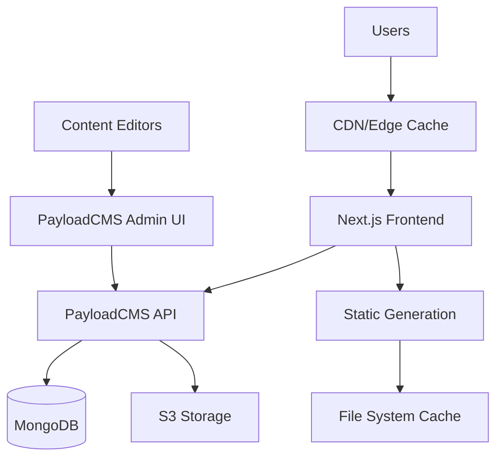
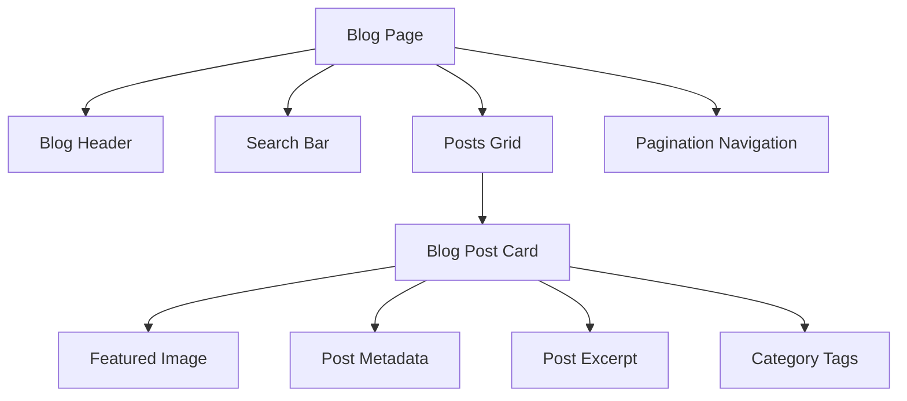
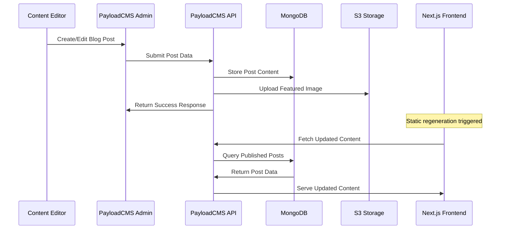
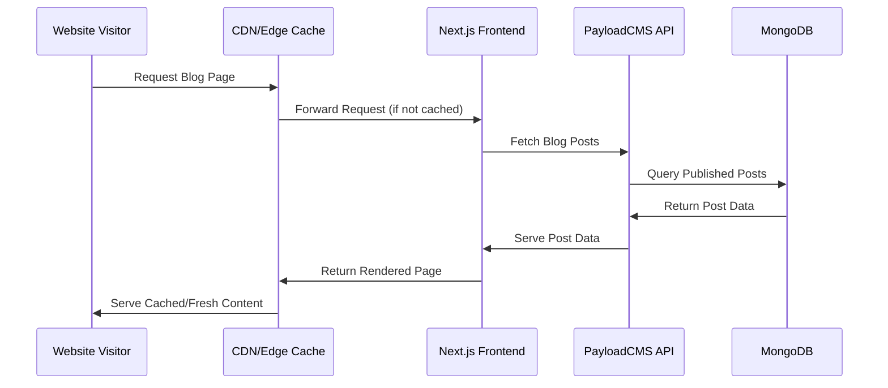
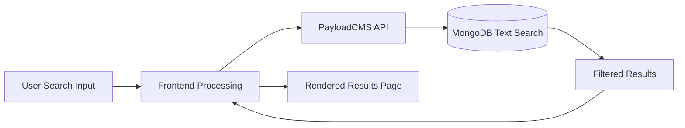
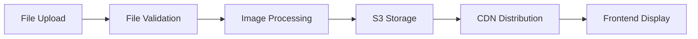
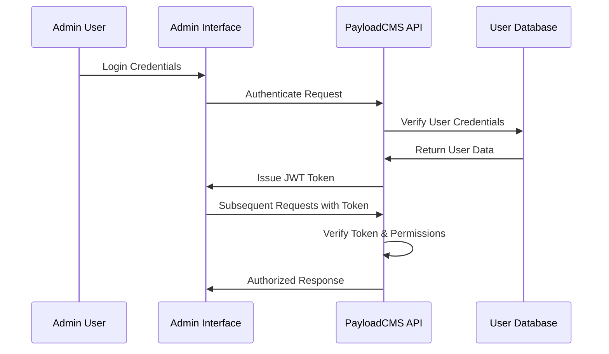
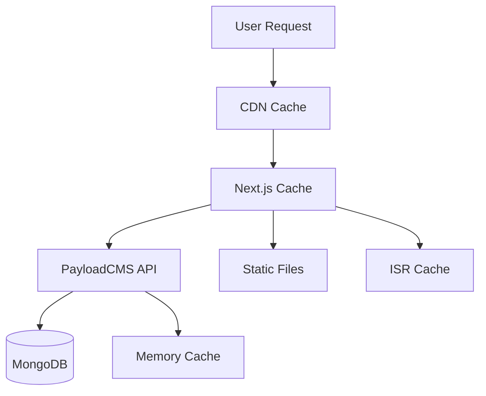
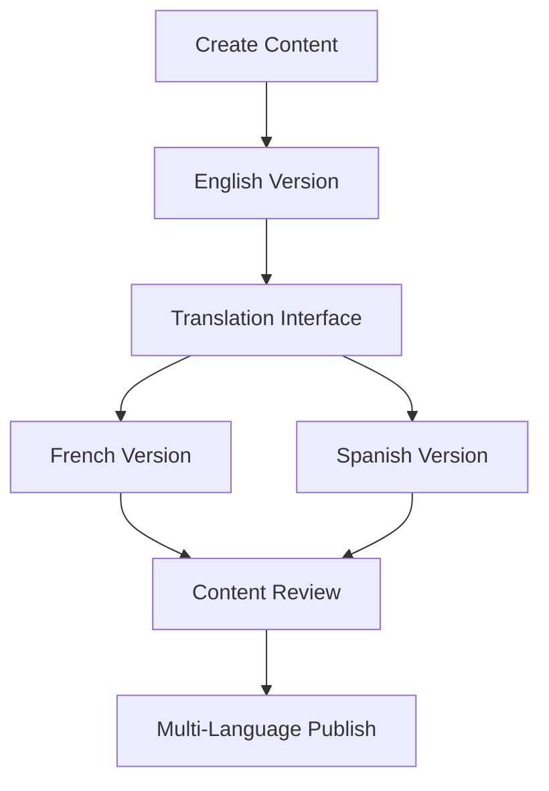

# Blog Architecture Overview

> **Last Updated**: August 2025  
> **Status**: Complete Implementation  
> **Version**: 1.0.0

## Overview

This document provides a comprehensive technical overview of the ISSI blog system architecture, including backend infrastructure, frontend implementation, data flow, and integration patterns. This guide is intended for developers, system architects, and technical stakeholders.

## Table of Contents

- [System Architecture](#system-architecture)
- [Backend Architecture](#backend-architecture)
- [Frontend Architecture](#frontend-architecture)
- [Data Flow & Integration](#data-flow--integration)
- [Database Schema](#database-schema)
- [File Storage Architecture](#file-storage-architecture)
- [Security Architecture](#security-architecture)
- [Performance Architecture](#performance-architecture)
- [Internationalization Architecture](#internationalization-architecture)
- [Deployment Architecture](#deployment-architecture)
- [Monitoring & Observability](#monitoring--observability)
- [Scalability Considerations](#scalability-considerations)

## System Architecture

### High-Level Overview



### Core Components

1. **Frontend Layer**
   - Next.js 15 App Router application
   - Server-side rendering and static generation
   - Responsive UI with Shadcn/ui components
   - Full internationalization support

2. **Backend Layer**
   - PayloadCMS 3.53.0 headless CMS
   - RESTful and GraphQL APIs
   - Authentication and authorization
   - Content management and workflow

3. **Data Layer**
   - MongoDB database with Mongoose ODM
   - S3-compatible object storage
   - Redis caching (future enhancement)
   - Search indexing capabilities

4. **Infrastructure Layer**
   - Node.js runtime environment
   - Webpack bundling and optimization
   - Environment-based configuration
   - Monitoring and logging systems

## Backend Architecture

### PayloadCMS Configuration

#### Core Configuration Structure

```typescript
// payload.config.ts
export default buildConfig({
  serverURL: process.env.PAYLOAD_PUBLIC_SERVER_URL,
  admin: {
    user: Users.slug,
    bundler: webpackBundler(),
    buildPath: path.resolve(__dirname, './build'),
  },
  collections: [Users, Posts, Media, Categories],
  localization: {
    locales: ['en', 'fr', 'es'],
    defaultLocale: 'en',
    fallback: true,
  },
  db: mongooseAdapter({
    url: process.env.DATABASE_URI,
  }),
  plugins: [
    cloudStorage({ /* S3 configuration */ }),
    seoPlugin({ /* SEO optimization */ }),
  ],
});
```

#### Collection Architecture

##### Posts Collection Schema
```typescript
{
  slug: 'posts',
  fields: [
    { name: 'title', type: 'text', localized: true, required: true },
    { name: 'slug', type: 'text', localized: true, unique: true },
    { name: 'content', type: 'richText', localized: true },
    { name: 'excerpt', type: 'textarea', localized: true },
    { name: 'author', type: 'relationship', relationTo: 'users' },
    { name: 'featuredImage', type: 'relationship', relationTo: 'media' },
    { name: 'categories', type: 'relationship', relationTo: 'categories', hasMany: true },
    { name: 'status', type: 'select', options: ['draft', 'published'] },
    { name: 'publishedAt', type: 'date' },
  ],
  timestamps: true,
}
```

#### API Architecture

**REST Endpoints**
- `GET /api/posts` - List posts with pagination, filtering, and search
- `GET /api/posts/:id` - Retrieve individual post with relationships
- `POST /api/posts` - Create new post (authenticated)
- `PATCH /api/posts/:id` - Update existing post (authenticated)
- `DELETE /api/posts/:id` - Delete post (authenticated)

**GraphQL Schema**
```graphql
type Post {
  id: ID!
  title: String!
  slug: String!
  content: JSON
  excerpt: String
  author: User
  featuredImage: Media
  categories: [Category]
  status: PostStatus!
  publishedAt: DateTime
  createdAt: DateTime!
  updatedAt: DateTime!
}
```

### Access Control System

#### Role-Based Permissions

```typescript
// cms/access/index.ts
export const isEditor = ({ req: { user } }) => {
  return user && ['admin', 'editor'].includes(user.role);
};

export const isLoggedInOrPublished = ({ req: { user } }) => {
  if (user) return true;
  
  return {
    and: [
      { status: { equals: 'published' } },
      { publishedAt: { less_than_equal: new Date() } },
    ],
  };
};
```

#### Security Layers
- **Authentication**: JWT-based session management
- **Authorization**: Role-based access control (RBAC)
- **CORS**: Configured for specific domain access
- **Rate Limiting**: 2400 requests per 2-minute window
- **CSRF Protection**: Cross-site request forgery prevention

## Frontend Architecture

### Next.js App Router Structure

```
src/app/[lang]/blog/
├── page.tsx                 # Blog listing page
├── [slug]/
│   └── page.tsx            # Individual blog post page
├── loading.tsx             # Loading UI (optional)
├── error.tsx              # Error boundary (optional)
└── not-found.tsx          # 404 handling (optional)
```

### Component Architecture

#### Page Components
- **BlogListingPage**: Main blog index with pagination and search
- **BlogPostPage**: Individual post display with rich content
- **BlogPostCard**: Reusable post preview component
- **BlogPagination**: Accessible pagination component
- **RichTextRenderer**: Slate content rendering component

#### Component Hierarchy


### Data Fetching Strategy

#### Server-Side Data Fetching
```typescript
// Server Components with async/await
async function PageContent({ locale, page, search }: PageContentProps) {
  const payload = await getPayload();
  
  const result = await payload.find({
    collection: 'posts',
    where: buildQueryFilters(search),
    limit: 10,
    page,
    locale,
    depth: 2, // Include relationships
    sort: '-publishedAt',
  });
  
  return <BlogContent posts={result.docs} pagination={result} />;
}
```

#### Static Generation Strategy
- **generateStaticParams**: Pre-generate all published post pages
- **ISR**: Incremental Static Regeneration for content updates
- **Dynamic Routes**: On-demand generation for new content

### Styling Architecture

#### Design System Integration
- **Shadcn/ui**: Core component library with consistent theming
- **Tailwind CSS**: Utility-first styling with custom design tokens
- **CSS Custom Properties**: Theme-aware color system
- **Responsive Design**: Mobile-first with breakpoint system

#### Typography and Layout
```css
/* Prose styling for rich content */
.prose {
  @apply prose-lg max-w-none dark:prose-invert;
  @apply prose-headings:font-semibold prose-headings:tracking-tight;
  @apply prose-h1:text-3xl prose-h2:text-2xl prose-h3:text-xl;
  @apply prose-a:text-primary prose-a:no-underline hover:prose-a:underline;
  @apply prose-img:rounded-lg prose-img:shadow-md;
}
```

## Data Flow & Integration

### Content Creation Flow



### Content Consumption Flow



### Search and Filtering Flow



## Database Schema

### MongoDB Collections Structure

#### Posts Collection
```javascript
{
  _id: ObjectId,
  title: {
    en: "English Title",
    fr: "Titre Français",
    es: "Título Español"
  },
  slug: {
    en: "english-title",
    fr: "titre-francais", 
    es: "titulo-espanol"
  },
  content: {
    en: { /* Rich text JSON */ },
    fr: { /* Rich text JSON */ },
    es: { /* Rich text JSON */ }
  },
  excerpt: {
    en: "English excerpt...",
    fr: "Extrait français...",
    es: "Extracto español..."
  },
  author: ObjectId, // Reference to users collection
  featuredImage: ObjectId, // Reference to media collection
  categories: [ObjectId], // Array of category references
  status: "published" | "draft",
  publishedAt: ISODate,
  createdAt: ISODate,
  updatedAt: ISODate
}
```

#### Users Collection
```javascript
{
  _id: ObjectId,
  email: "user@example.com",
  password: "hashed_password",
  firstName: "John",
  lastName: "Doe",
  role: "admin" | "editor",
  createdAt: ISODate,
  updatedAt: ISODate
}
```

#### Categories Collection
```javascript
{
  _id: ObjectId,
  title: {
    en: "Technology",
    fr: "Technologie",
    es: "Tecnología"
  },
  description: {
    en: "Technology related posts",
    fr: "Articles liés à la technologie",
    es: "Artículos relacionados con tecnología"
  },
  createdAt: ISODate,
  updatedAt: ISODate
}
```

#### Media Collection
```javascript
{
  _id: ObjectId,
  filename: "image.jpg",
  mimeType: "image/jpeg",
  filesize: 1024000,
  width: 1200,
  height: 800,
  alt: "Alt text description",
  caption: "Image caption",
  url: "https://bucket.s3.amazonaws.com/path/to/image.jpg",
  createdAt: ISODate,
  updatedAt: ISODate
}
```

### Indexing Strategy

```javascript
// Database indexes for optimal performance
db.posts.createIndex({ "title.en": "text", "content.en": "text", "excerpt.en": "text" });
db.posts.createIndex({ "title.fr": "text", "content.fr": "text", "excerpt.fr": "text" });
db.posts.createIndex({ "title.es": "text", "content.es": "text", "excerpt.es": "text" });
db.posts.createIndex({ publishedAt: -1 });
db.posts.createIndex({ status: 1, publishedAt: -1 });
db.posts.createIndex({ "slug.en": 1 }, { unique: true });
db.posts.createIndex({ "slug.fr": 1 }, { unique: true });
db.posts.createIndex({ "slug.es": 1 }, { unique: true });
```

## File Storage Architecture

### S3-Compatible Storage Configuration

#### Storage Structure
```
bucket-name/
├── media/
│   ├── original/
│   │   └── [filename].[ext]
│   ├── thumbnails/
│   │   └── [filename]-thumb.[ext]
│   └── optimized/
│       └── [filename]-opt.[ext]
└── uploads/
    └── temp/
        └── [temp-files]
```

#### Integration Flow


#### Configuration
```typescript
cloudStorage({
  collections: {
    media: {
      adapter: s3Adapter({
        config: {
          endpoint: process.env.S3_ENDPOINT,
          credentials: {
            accessKeyId: process.env.S3_ACCESS_KEY_ID,
            secretAccessKey: process.env.S3_SECRET_ACCESS_KEY,
          },
          region: process.env.S3_REGION,
        },
        bucket: process.env.S3_BUCKET,
      }),
    },
  },
})
```

## Security Architecture

### Authentication & Authorization

#### JWT Token Flow


#### Security Measures
- **Password Hashing**: bcrypt with configurable rounds
- **Session Management**: Secure JWT tokens with expiration
- **CORS Configuration**: Strict origin validation
- **Rate Limiting**: API endpoint protection
- **Input Validation**: Comprehensive data sanitization
- **SQL Injection Prevention**: Mongoose ODM protection

### Content Security

#### Access Control Matrix
| Role | Create Posts | Edit Posts | Delete Posts | Publish Posts | Manage Users |
|------|--------------|------------|--------------|---------------|--------------|
| Admin | ✅ | ✅ | ✅ | ✅ | ✅ |
| Editor | ✅ | ✅ | ❌ | ✅ | ❌ |
| User | ❌ | ❌ | ❌ | ❌ | ❌ |

#### Content Validation
- **Rich Text Sanitization**: XSS prevention in content
- **Image Validation**: File type and size restrictions
- **URL Validation**: Link security checks
- **Input Sanitization**: HTML entity encoding

## Performance Architecture

### Caching Strategy

#### Multi-Layer Caching


#### Cache Invalidation
- **Content Updates**: Automatic ISR revalidation
- **Media Changes**: CDN purge on upload
- **User Actions**: Selective cache invalidation
- **Time-Based**: TTL-based cache expiry

### Optimization Techniques

#### Frontend Optimizations
- **Code Splitting**: Route-based and component-based
- **Image Optimization**: Next.js Image component with WebP
- **Bundle Analysis**: Webpack bundle optimization
- **Critical CSS**: Above-the-fold styling priority
- **Service Worker**: Offline caching (future enhancement)

#### Backend Optimizations
- **Database Indexing**: Strategic index placement
- **Query Optimization**: Efficient MongoDB queries
- **Connection Pooling**: Database connection management
- **Compression**: Gzip/Brotli response compression

### Performance Monitoring

#### Key Metrics
- **Page Load Time**: First Contentful Paint, Largest Contentful Paint
- **Core Web Vitals**: LCP, FID, CLS measurements
- **API Response Time**: Database query performance
- **Cache Hit Ratios**: Caching effectiveness
- **Bundle Size**: JavaScript bundle optimization

## Internationalization Architecture

### Multi-Language Content Strategy

#### Language Routing
```
/en/blog          → English blog listing
/fr/blog          → French blog listing  
/es/blog          → Spanish blog listing
/en/blog/[slug]   → English blog post
/fr/blog/[slug]   → French blog post
/es/blog/[slug]   → Spanish blog post
```

#### Content Localization Flow


#### Database Localization
```javascript
// Localized field structure
{
  title: {
    en: "English Title",
    fr: "Titre Français", 
    es: "Título Español"
  }
}
```

### SEO Internationalization

#### Hreflang Implementation
```html
<link rel="alternate" hreflang="en" href="https://example.com/en/blog/post" />
<link rel="alternate" hreflang="fr" href="https://example.com/fr/blog/post" />
<link rel="alternate" hreflang="es" href="https://example.com/es/blog/post" />
<link rel="alternate" hreflang="x-default" href="https://example.com/en/blog/post" />
```

#### Structured Data Localization
- **Language-specific schemas**: Content in appropriate language
- **Regional targeting**: geo-specific structured data
- **Currency and dates**: Locale-appropriate formatting

## Deployment Architecture

### Environment Configuration

#### Development Environment
- **Local MongoDB**: Development database
- **Local S3**: MinIO or similar for development
- **Hot Reloading**: Next.js development server
- **Debug Mode**: Detailed error reporting

#### Staging Environment
- **Replica Database**: Production-like data
- **Staging S3 bucket**: Isolated file storage
- **Performance Testing**: Load testing capabilities
- **Integration Testing**: End-to-end test suite

#### Production Environment
- **Clustered MongoDB**: High availability database
- **CDN Integration**: Global content delivery
- **Monitoring Systems**: Health checks and alerting
- **Backup Systems**: Automated data protection

### Container Architecture

#### Docker Configuration
```dockerfile
# Multi-stage build for optimization
FROM node:18-alpine AS base
FROM base AS deps
FROM base AS builder
FROM base AS runner

# Production optimizations
EXPOSE 3000
CMD ["npm", "start"]
```

#### Kubernetes Deployment
```yaml
apiVersion: apps/v1
kind: Deployment
metadata:
  name: issi-blog
spec:
  replicas: 3
  selector:
    matchLabels:
      app: issi-blog
  template:
    spec:
      containers:
      - name: blog-app
        image: issi/blog:latest
        ports:
        - containerPort: 3000
```

## Monitoring & Observability

### Application Monitoring

#### Health Checks
- **Database Connectivity**: MongoDB connection status
- **Storage Accessibility**: S3 bucket availability
- **API Responsiveness**: Endpoint health monitoring
- **Memory Usage**: Node.js memory consumption

#### Performance Metrics
```javascript
// Custom metrics collection
const metrics = {
  blogPostViews: counter(),
  apiResponseTime: histogram(),
  databaseQueryDuration: histogram(),
  cacheHitRate: gauge(),
};
```

#### Error Tracking
- **Application Errors**: Runtime error capture
- **Database Errors**: Connection and query issues
- **File Upload Errors**: S3 upload failures
- **Authentication Errors**: Login and permission issues

### Logging Strategy

#### Structured Logging
```javascript
logger.info('Blog post published', {
  postId: post.id,
  author: post.author.email,
  locale: post.locale,
  timestamp: new Date().toISOString(),
  action: 'publish',
});
```

#### Log Levels
- **ERROR**: Application errors and exceptions
- **WARN**: Potential issues and deprecated features
- **INFO**: General application events
- **DEBUG**: Detailed debugging information

## Scalability Considerations

### Horizontal Scaling

#### Application Scaling
- **Load Balancing**: Multiple Next.js instances
- **Database Sharding**: MongoDB horizontal partitioning
- **CDN Distribution**: Global content delivery
- **Microservices**: Service decomposition (future)

#### Performance Bottlenecks
- **Database Queries**: Index optimization and query caching
- **File Uploads**: Parallel processing and compression
- **Image Processing**: Background job processing
- **Search Functionality**: Elasticsearch integration (future)

### Vertical Scaling

#### Resource Optimization
- **Memory Management**: Efficient garbage collection
- **CPU Utilization**: Process optimization
- **Storage I/O**: SSD optimization and caching
- **Network Bandwidth**: Compression and optimization

### Future Architecture Enhancements

#### Planned Improvements
1. **Redis Caching**: Application-level caching layer
2. **Elasticsearch**: Advanced search capabilities
3. **GraphQL Federation**: Distributed schema management
4. **Event Sourcing**: Audit trail and replay capabilities
5. **Microservices**: Service decomposition for scalability
6. **Real-time Features**: WebSocket integration for live updates

---

This architecture overview provides the technical foundation for understanding, maintaining, and extending the ISSI blog system. For implementation details, refer to:
- [Blog Implementation Guide](./BLOG_IMPLEMENTATION_GUIDE.md)
- [Development Reference](./BLOG_DEVELOPMENT_REFERENCE.md)
- [Content Management Guide](./BLOG_CONTENT_MANAGEMENT_GUIDE.md)