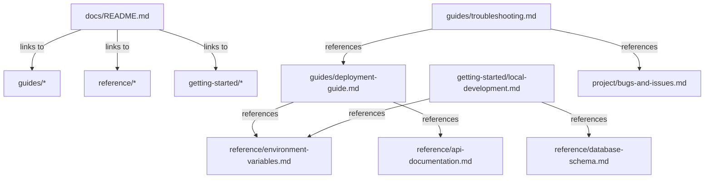

# Documentation Maintenance Guide 📝

This guide explains how to maintain and update the project documentation to keep it current and useful.

## 📁 Documentation Structure

The documentation is organized into logical directories for easy navigation and maintenance:

```
docs/
├── README.md                      # Main documentation index
├── maintenance/
│   ├── doc-maintenance-guide.md   # This file - how to maintain docs
│   └── documentation-standards.md # Writing standards and conventions
├── getting-started/
│   ├── local-development.md       # Local setup and development
│   ├── quick-start.md            # Fastest way to get running
│   └── first-time-setup.md       # Detailed first-time setup
├── guides/
│   ├── deployment-guide.md       # Production deployment
│   ├── content-management.md     # Using the CMS
│   ├── collection-management.md  # Working with PayloadCMS collections
│   └── troubleshooting.md        # Common issues and solutions
├── reference/
│   ├── api-documentation.md      # Complete API reference
│   ├── database-schema.md        # Collections and relationships
│   ├── configuration.md          # PayloadCMS configuration
│   └── environment-variables.md  # All environment settings
├── project/
│   ├── project-summary.md        # Architecture and decisions
│   ├── change-log.md             # Version history
│   ├── bugs-and-issues.md        # Known issues
│   └── expert-persona-alex.md    # Expert knowledge base
└── examples/
    ├── api-examples.md           # API usage examples
    ├── seeding-examples.md       # Database seeding patterns
    └── custom-collections.md    # Creating new collections
```

## 🔄 When to Update Documentation

### Code Changes That Require Doc Updates

| Change Type | Documents to Update | Priority |
|-------------|-------------------|----------|
| **New Collection** | `database-schema.md`, `api-documentation.md`, `collection-management.md` | High |
| **New API Endpoint** | `api-documentation.md`, `api-examples.md` | High |
| **Environment Variable** | `environment-variables.md`, `local-development.md`, `deployment-guide.md` | High |
| **Deployment Process** | `deployment-guide.md`, `troubleshooting.md` | Critical |
| **Package.json Scripts** | `local-development.md`, `deployment-guide.md` | Medium |
| **Database Schema** | `database-schema.md`, `seeding-examples.md` | High |
| **Configuration Change** | `configuration.md`, `local-development.md` | Medium |
| **Bug Fix** | `bugs-and-issues.md`, `troubleshooting.md`, `change-log.md` | Low |
| **New Feature** | Relevant guide + `change-log.md` + `project-summary.md` | Medium |

### Regular Maintenance Schedule

- **Weekly**: Review and update `bugs-and-issues.md` with resolved issues
- **After Each Deploy**: Update `change-log.md` with changes
- **Monthly**: Review all guides for accuracy and completeness
- **After Major Changes**: Update `project-summary.md` with architectural changes

## 📝 Documentation Update Process

### 1. Identify What Needs Updating

Before making code changes, identify affected documentation:

```bash
# Search for references to what you're changing
grep -r "old-feature-name" docs/
grep -r "environment-variable" docs/
grep -r "api-endpoint" docs/
```

### 2. Update Documents in Order

1. **Reference docs first**: `api-documentation.md`, `database-schema.md`
2. **Guides second**: `deployment-guide.md`, `local-development.md`
3. **Project docs last**: `change-log.md`, `project-summary.md`

### 3. Cross-Reference Check

Ensure all internal links still work:

```bash
# Check for broken internal links
grep -r "]\(./" docs/ | grep -v "README.md"
```

### 4. Update Main Index

Always update `docs/README.md` when:
- Adding new documentation files
- Changing documentation structure
- Adding new quick start paths

## 🎯 Documentation Standards

### File Naming Convention
- Use kebab-case: `local-development.md`
- Be descriptive: `deployment-guide.md` not `deploy.md`
- Include category in path: `guides/deployment-guide.md`

### Content Structure
Each document should have:
1. **Clear title** with emoji for visual identification
2. **Brief description** of what the document covers
3. **Table of contents** for long documents (>500 words)
4. **Cross-references** to related documents
5. **Last updated** date at bottom

### Link Standards
- **Internal links**: Relative paths from docs root
  ```markdown
  [API Guide](./reference/api-documentation.md)
  [Local Setup](./getting-started/local-development.md)
  ```
- **External links**: Full URLs with descriptive text
- **Section links**: Use anchor tags for specific sections

## 🚨 Critical Documentation Updates

### Deployment Issues (CRITICAL)
Any change to deployment process MUST be updated in:
1. `guides/deployment-guide.md` - Full details
2. `getting-started/quick-start.md` - Quick reference
3. `README.md` - Critical warnings section
4. All AI tool folder READMEs - Context updates

### API Changes (HIGH)
API modifications require updates to:
1. `reference/api-documentation.md` - Complete endpoint docs
2. `examples/api-examples.md` - Working examples
3. `getting-started/local-development.md` - If affects dev workflow

### Environment Changes (HIGH)
New or changed environment variables must be updated in:
1. `reference/environment-variables.md` - Complete reference
2. `getting-started/local-development.md` - Setup instructions
3. `guides/deployment-guide.md` - Production configuration
4. `.env.example` file - Template values

## 📚 Documentation Dependencies

### Files That Reference Each Other
Track these dependencies when updating:



### AI Tool Documentation Dependencies
When updating main docs, also update:
- `.gemini/README.md`
- `.crush/README.md` 
- `.cursor/README.md`
- `.claude/README.md`
- `.windsurf/README.md`

These should reference the most relevant main documentation for their context.

## 🔧 Documentation Tools

### Automated Checks
```bash
# Check for broken links (install markdown-link-check)
npx markdown-link-check docs/**/*.md

# Check for orphaned files
find docs -name "*.md" -exec grep -l {} docs/README.md \; | wc -l

# Validate markdown syntax
npx markdownlint docs/**/*.md
```

### Documentation Scripts
Consider adding to `package.json`:
```json
{
  "scripts": {
    "docs:check": "markdown-link-check docs/**/*.md",
    "docs:lint": "markdownlint docs/**/*.md",
    "docs:serve": "docsify serve docs"
  }
}
```

## 📋 Documentation Checklist

Before committing documentation changes:

- [ ] Updated all affected reference documents
- [ ] Updated relevant guides and tutorials  
- [ ] Cross-checked internal links
- [ ] Updated main documentation index if needed
- [ ] Updated AI tool folder READMEs if context changed
- [ ] Added entry to change-log.md
- [ ] Tested any code examples included
- [ ] Verified markdown formatting
- [ ] Updated "last modified" dates

## 🎯 Quality Standards

### Writing Guidelines
- **Be concise but complete**
- **Use active voice**
- **Include working examples**
- **Explain why, not just how**
- **Consider different skill levels**

### Code Examples
- **Always test examples before documenting**
- **Include expected output**
- **Show error handling**
- **Use realistic data**

### Maintenance
- **Review quarterly** for accuracy
- **Update after major releases**
- **Remove outdated information**
- **Consolidate duplicate content**

---

**Remember**: Documentation is code. It should be maintained with the same rigor as the codebase itself.

**Last Updated**: September 2, 2025
