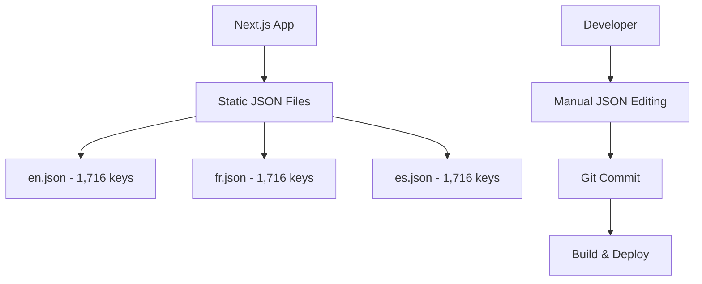
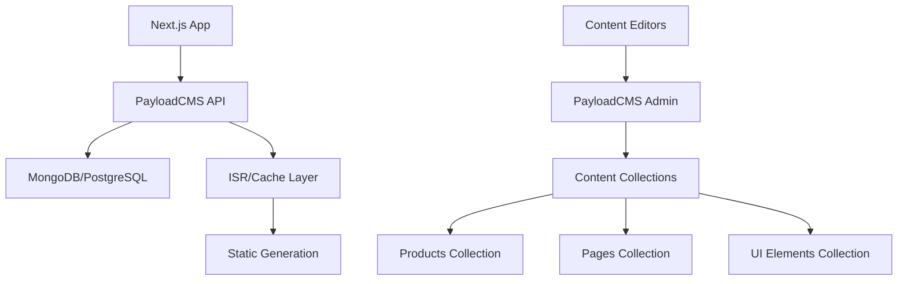

# Product Requirements Document (PRD)

# PayloadCMS Migration for ISSI Next.js i18n Dashboard

**Document Version**: 1.0  
**Created**: August 11, 2025  
**Project Codename**: Phoenix  
**Priority**: P1 - High Priority Strategic Initiative

---

## 📋 Document Information

| **Field**          | **Details**                                       |
| ------------------ | ------------------------------------------------- |
| **Product Owner**  | ISSI Development Team                             |
| **Technical Lead** | Senior Full-Stack Developer                       |
| **Target Release** | Q4 2025                                           |
| **Status**         | Planning Phase                                    |
| **Stakeholders**   | Development Team, Content Editors, Marketing Team |

---

## 🎯 Project Overview

### **Problem Statement**

The ISSI Next.js i18n Dashboard currently relies on a static JSON-based content management system that creates significant operational bottlenecks:

- **Developer Dependency**: All content updates require developer intervention
- **Error-Prone Process**: Manual JSON editing leads to syntax errors and content inconsistencies
- **Scalability Issues**: Managing 5,148+ translation strings across 3 languages is becoming unwieldy
- **Workflow Inefficiency**: No approval process or version control for content changes
- **Limited Accessibility**: Non-technical team members cannot contribute to content updates

### **Solution Vision**

Migrate the ISSI dashboard to a PayloadCMS-driven architecture that provides:

- **Editorial Independence**: Non-technical users can manage content through an intuitive admin interface
- **Workflow Automation**: Built-in approval processes and version control
- **Enhanced Scalability**: Support for additional languages and content types
- **API-First Architecture**: Foundation for future integrations and mobile applications
- **Operational Efficiency**: 75% reduction in content update time and eliminated developer bottlenecks

---

## 🎯 Success Metrics & KPIs

### **Primary Success Metrics**

| **Metric**                 | **Current State**              | **Target State**             | **Success Criteria**              |
| -------------------------- | ------------------------------ | ---------------------------- | --------------------------------- |
| Content Update Time        | 2-4 hours (developer required) | 15-30 minutes (self-service) | 75% reduction                     |
| Content Editor Autonomy    | 0% (developer dependent)       | 90% (self-sufficient)        | Non-technical editors can publish |
| Translation Workflow Speed | 1-2 weeks (manual process)     | 2-3 days (streamlined)       | 50% improvement                   |
| Content Consistency Errors | 5-10 per month                 | <1 per month                 | 90% error reduction               |
| Time to Add New Language   | 4-6 weeks                      | 1-2 weeks                    | 60% faster internationalization   |

### **Business Impact Goals**

- **Operational Cost Savings**: $10,000/year in reduced developer time
- **Time to Market**: 50% faster content publishing for marketing campaigns
- **Editorial Productivity**: Enable 3+ non-technical staff to manage content
- **International Expansion**: Foundation for adding 2+ additional languages
- **Future Scalability**: API-ready for mobile app and third-party integrations

---

## 🏗️ Technical Architecture

### **Current State Architecture**



### **Target State Architecture**



### **Core Technology Stack**

| **Component**      | **Technology**          | **Purpose**                               |
| ------------------ | ----------------------- | ----------------------------------------- |
| **CMS Platform**   | PayloadCMS 2.0+         | Headless content management               |
| **Database**       | MongoDB Atlas           | Content storage with localization support |
| **Frontend**       | Next.js 14 (App Router) | Existing application framework            |
| **Caching**        | ISR + Redis             | Performance optimization                  |
| **Media Storage**  | Cloudinary/AWS S3       | Image and document management             |
| **Authentication** | PayloadCMS Auth         | Role-based access control                 |

---

## 📦 Feature Requirements

### **🔥 Must-Have Features (P0)**

#### **1. Multi-Language Content Management**

- **Requirement**: Support for English, French, Spanish with locale fallbacks
- **User Story**: As a content editor, I want to create and edit content in multiple languages from a single interface
- **Acceptance Criteria**:
  - ✅ All content fields support localization
  - ✅ Language switching in admin interface
  - ✅ Fallback to default language when translation missing
  - ✅ Bulk translation import/export capability

#### **2. Product Catalog Management**

- **Requirement**: Comprehensive product content management system
- **User Story**: As a marketing manager, I want to manage all 30+ product pages including features, specifications, and media
- **Acceptance Criteria**:
  - ✅ Product creation/editing interface
  - ✅ Rich text editor for descriptions
  - ✅ Feature list management with icons
  - ✅ Image upload and optimization
  - ✅ SEO metadata management
  - ✅ Category and tag management

#### **3. Static Page Content Management**

- **Requirement**: Management of all static pages (About, Services, Legal, etc.)
- **User Story**: As a content editor, I want to update page content without developer assistance
- **Acceptance Criteria**:
  - ✅ Page template system
  - ✅ Flexible content blocks (hero, features, testimonials)
  - ✅ SEO metadata editing
  - ✅ Navigation menu management
  - ✅ Footer content editing

#### **4. UI Element Localization**

- **Requirement**: Management of buttons, labels, error messages, and interface text
- **User Story**: As a UX writer, I want to update interface text and error messages across all languages
- **Acceptance Criteria**:
  - ✅ Categorized UI element organization
  - ✅ Bulk editing capabilities
  - ✅ Search and filter functionality
  - ✅ Change tracking and approval workflow

### **🚀 Should-Have Features (P1)**

#### **5. Content Approval Workflow**

- **Requirement**: Editorial review process before content goes live
- **User Story**: As a content manager, I want to review and approve content changes before publication
- **Acceptance Criteria**:
  - ✅ Draft/pending/published content states
  - ✅ Role-based permissions (Editor, Reviewer, Admin)
  - ✅ Comment and feedback system
  - ✅ Email notifications for approval requests

#### **6. Media Management System**

- **Requirement**: Centralized media library with optimization
- **User Story**: As a content creator, I want to upload, organize, and optimize images for products and pages
- **Acceptance Criteria**:
  - ✅ Drag-and-drop media upload
  - ✅ Automatic image optimization and resizing
  - ✅ Alt text and metadata management
  - ✅ Media organization with folders and tags
  - ✅ Usage tracking across content

#### **7. SEO Management Tools**

- **Requirement**: Advanced SEO metadata and optimization features
- **User Story**: As an SEO specialist, I want to optimize metadata, URLs, and structured data for all content
- **Acceptance Criteria**:
  - ✅ Meta title and description editing
  - ✅ OpenGraph and Twitter Card management
  - ✅ Structured data (JSON-LD) generation
  - ✅ URL slug management
  - ✅ SEO score and recommendations

### **🎁 Nice-to-Have Features (P2)**

#### **8. Content Analytics Dashboard**

- **Requirement**: Usage analytics and performance metrics
- **User Story**: As a content manager, I want to see which content performs best and needs updates
- **Acceptance Criteria**:
  - ✅ Page view analytics integration
  - ✅ Content freshness tracking
  - ✅ Popular content identification
  - ✅ Translation completeness metrics

#### **9. Content Scheduling**

- **Requirement**: Ability to schedule content publication
- **User Story**: As a marketing coordinator, I want to schedule content updates for specific dates and times
- **Acceptance Criteria**:
  - ✅ Future publication date setting
  - ✅ Content embargo functionality
  - ✅ Automatic publishing workflows
  - ✅ Timezone-aware scheduling

---

## 👥 User Personas & Use Cases

### **Primary Users**

#### **Content Editor (Sarah)**

- **Role**: Marketing coordinator responsible for product page updates
- **Goals**: Update product information quickly and accurately
- **Pain Points**: Currently depends on developers for all content changes
- **Use Cases**:
  - Edit product descriptions and features
  - Upload new product images
  - Update pricing and availability information
  - Create marketing campaign content

#### **Translation Manager (Miguel)**

- **Role**: Manages French and Spanish content translations
- **Goals**: Ensure translation accuracy and consistency across languages
- **Pain Points**: Manual JSON editing prone to syntax errors
- **Use Cases**:
  - Review and approve translations
  - Bulk import/export translation files
  - Track translation completeness
  - Coordinate with external translation services

#### **SEO Specialist (Emma)**

- **Role**: Optimizes content for search engine performance
- **Goals**: Improve organic search rankings and traffic
- **Pain Points**: Limited ability to optimize metadata and structured data
- **Use Cases**:
  - Edit meta titles and descriptions
  - Manage OpenGraph and Twitter Card data
  - Generate and validate structured data
  - Monitor SEO performance metrics

#### **Developer (Alex)**

- **Role**: Frontend/backend developer maintaining the application
- **Goals**: Focus on feature development rather than content updates
- **Pain Points**: Constant interruptions for content changes
- **Use Cases**:
  - Configure CMS schemas and collections
  - Implement new content types and fields
  - Monitor system performance and uptime
  - Integrate with external APIs and services

---

## 🗓️ Implementation Timeline

### **Phase 1: Foundation Setup (Weeks 1-2)**

#### **Week 1: PayloadCMS Infrastructure**

- **Day 1-2**: PayloadCMS installation and initial configuration
- **Day 3-4**: Database setup (MongoDB Atlas) and connection
- **Day 5**: Authentication system and role configuration

#### **Week 2: Core Schema Development**

- **Day 1-2**: Products collection schema and admin interface
- **Day 3-4**: Pages collection schema and content blocks
- **Day 5**: UI Elements collection and localization setup

**Deliverables:**

- ✅ PayloadCMS admin panel accessible
- ✅ Core collections defined and configured
- ✅ Localization support for EN/FR/ES
- ✅ Role-based access control implemented

### **Phase 2: Content Migration (Weeks 3-4)**

#### **Week 3: Automated Migration Scripts**

- **Day 1-2**: JSON parsing and transformation scripts
- **Day 3-4**: Product data migration and validation
- **Day 5**: Static page content migration

#### **Week 4: Content Quality Assurance**

- **Day 1-2**: Translation accuracy verification
- **Day 3-4**: Media file migration and optimization
- **Day 5**: SEO metadata migration and validation

**Deliverables:**

- ✅ All 5,148 translation strings migrated
- ✅ 30+ product pages fully populated
- ✅ 40+ static pages content migrated
- ✅ Media library organized and optimized

### **Phase 3: Frontend Integration (Weeks 5-6)**

#### **Week 5: API Integration**

- **Day 1-2**: PayloadCMS API client implementation
- **Day 3-4**: Product page component refactoring
- **Day 5**: Static page component updates

#### **Week 6: Performance Optimization**

- **Day 1-2**: ISR (Incremental Static Regeneration) setup
- **Day 3-4**: Caching layer implementation
- **Day 5**: CDN configuration and optimization

**Deliverables:**

- ✅ Frontend consuming PayloadCMS API
- ✅ All pages rendering from CMS data
- ✅ Performance benchmarks maintained
- ✅ SEO functionality preserved

### **Phase 4: Testing & Launch (Weeks 7-8)**

#### **Week 7: Comprehensive Testing**

- **Day 1-2**: Content accuracy validation
- **Day 3-4**: Performance and load testing
- **Day 5**: Accessibility and SEO auditing

#### **Week 8: Training & Go-Live**

- **Day 1-2**: Content editor training sessions
- **Day 3-4**: Soft launch with stakeholder review
- **Day 5**: Production deployment and monitoring

**Deliverables:**

- ✅ All acceptance criteria validated
- ✅ Team trained on PayloadCMS usage
- ✅ Production system live and monitored
- ✅ Rollback plan ready if needed

---

## 🔧 Technical Specifications

### **PayloadCMS Configuration**

#### **Collections Structure**

```typescript
// payload.config.ts
export default buildConfig({
  serverURL: process.env.PAYLOAD_PUBLIC_SERVER_URL,
  admin: {
    user: Users.slug,
    buildPath: path.resolve(__dirname, "../build"),
  },
  collections: [Products, Pages, Media, UIElements, Users],
  globals: [Settings, Navigation],
  localization: {
    locales: ["en", "fr", "es"],
    defaultLocale: "en",
    fallback: true,
  },
  plugins: [
    cloudStorage({
      collections: {
        media: {
          adapter: s3Adapter({
            config: {
              endpoint: process.env.S3_ENDPOINT,
              credentials: {
                accessKeyId: process.env.S3_ACCESS_KEY_ID,
                secretAccessKey: process.env.S3_SECRET_ACCESS_KEY,
              },
              region: process.env.S3_REGION,
            },
          }),
        },
      },
    }),
    seo({
      collections: ["products", "pages"],
      uploadsCollection: "media",
    }),
  ],
});
```

#### **Products Collection Schema**

```typescript
const Products: CollectionConfig = {
  slug: "products",
  admin: {
    useAsTitle: "title",
    defaultColumns: ["title", "category", "status", "updatedAt"],
  },
  access: {
    read: () => true,
    create: isEditor,
    update: isEditor,
    delete: isAdmin,
  },
  fields: [
    {
      name: "title",
      type: "text",
      required: true,
      localized: true,
    },
    {
      name: "slug",
      type: "text",
      required: true,
      unique: true,
      admin: {
        position: "sidebar",
      },
    },
    {
      name: "category",
      type: "select",
      required: true,
      options: [
        { label: "Featured", value: "featured" },
        { label: "Project Management", value: "project" },
        { label: "HR Solutions", value: "hr" },
        { label: "Compliance", value: "compliance" },
        { label: "Data Management", value: "data" },
        { label: "Modernization", value: "modernization" },
      ],
    },
    {
      name: "hero",
      type: "group",
      fields: [
        {
          name: "tagline",
          type: "text",
          localized: true,
        },
        {
          name: "title",
          type: "text",
          required: true,
          localized: true,
        },
        {
          name: "context",
          type: "textarea",
          localized: true,
        },
        {
          name: "description",
          type: "richText",
          localized: true,
        },
        {
          name: "image",
          type: "upload",
          relationTo: "media",
          required: true,
        },
      ],
    },
    {
      name: "features",
      type: "array",
      localized: true,
      fields: [
        {
          name: "name",
          type: "text",
          required: true,
        },
        {
          name: "description",
          type: "textarea",
        },
        {
          name: "icon",
          type: "text",
          admin: {
            description: "Icon name from icon library",
          },
        },
      ],
    },
  ],
  hooks: {
    beforeChange: [
      ({ data }) => {
        // Auto-generate slug from title if not provided
        if (!data.slug && data.title?.en) {
          data.slug = slugify(data.title.en, { lower: true });
        }
        return data;
      },
    ],
  },
};
```

### **API Integration Pattern**

#### **Data Fetching Functions**

```typescript
// lib/payload-client.ts
import { getPayloadClient } from "./getPayload";

export const getProducts = async (locale: string = "en") => {
  const payload = await getPayloadClient();

  const products = await payload.find({
    collection: "products",
    locale: locale as any,
    depth: 1,
    limit: 50,
  });

  return products.docs;
};

export const getProductBySlug = async (slug: string, locale: string = "en") => {
  const payload = await getPayloadClient();

  const products = await payload.find({
    collection: "products",
    where: {
      slug: { equals: slug },
    },
    locale: locale as any,
    limit: 1,
  });

  return products.docs[0] || null;
};

export const getPageBySlug = async (slug: string, locale: string = "en") => {
  const payload = await getPayloadClient();

  const pages = await payload.find({
    collection: "pages",
    where: {
      slug: { equals: slug },
    },
    locale: locale as any,
    limit: 1,
  });

  return pages.docs[0] || null;
};
```

#### **Next.js Integration**

```typescript
// app/[lang]/products/[slug]/page.tsx
import { getProductBySlug } from "@/lib/payload-client";
import { Locale } from "@/lib/definitions";

interface ProductPageProps {
  params: {
    lang: Locale;
    slug: string;
  };
}

export default async function ProductPage({ params }: ProductPageProps) {
  const product = await getProductBySlug(params.slug, params.lang);

  if (!product) {
    notFound();
  }

  return (
    <main>
      <section className="hero">
        <h1>{product.hero.title}</h1>
        <p>{product.hero.description}</p>
        <Image src={product.hero.image.url} alt={product.hero.image.alt} width={800} height={400} />
      </section>

      <section className="features">
        <h2>Key Features</h2>
        <div className="grid">
          {product.features.map((feature, index) => (
            <div key={index} className="feature-card">
              <h3>{feature.name}</h3>
              <p>{feature.description}</p>
            </div>
          ))}
        </div>
      </section>
    </main>
  );
}

export async function generateStaticParams() {
  const products = await getProducts();
  const locales: Locale[] = ["en", "fr", "es"];

  return products.flatMap((product) =>
    locales.map((lang) => ({
      lang,
      slug: product.slug,
    }))
  );
}

export const revalidate = 3600; // ISR every hour
```

---

## 🎯 Quality Assurance & Testing

### **Testing Strategy**

#### **Content Migration Testing**

- **Unit Tests**: Automated validation of migration scripts
- **Integration Tests**: API endpoints and data integrity
- **Content Accuracy**: Manual review of migrated content
- **Performance Tests**: Load testing with realistic data volumes

#### **Acceptance Testing Criteria**

| **Test Category**      | **Test Cases**                | **Success Criteria**              |
| ---------------------- | ----------------------------- | --------------------------------- |
| **Content Migration**  | All 5,148 translation strings | 100% accuracy, zero data loss     |
| **Performance**        | Page load times               | <3 seconds for all pages          |
| **SEO**                | Metadata and structured data  | No degradation in search rankings |
| **Accessibility**      | WCAG AA compliance            | All tests passing                 |
| **Multi-language**     | Content in EN/FR/ES           | Proper localization and fallbacks |
| **Editorial Workflow** | Content creation/editing      | Non-technical users can publish   |

### **Performance Benchmarks**

| **Metric**              | **Current** | **Target**  | **Monitoring**            |
| ----------------------- | ----------- | ----------- | ------------------------- |
| **Page Load Time**      | <3 seconds  | <3 seconds  | Lighthouse CI             |
| **API Response Time**   | N/A         | <500ms      | New Relic                 |
| **Content Update Time** | 2-4 hours   | 15-30 min   | User feedback             |
| **Build Time**          | 5-8 minutes | <10 minutes | GitHub Actions            |
| **SEO Score**           | 90+         | 90+         | Lighthouse/Search Console |

---

## 🚨 Risk Assessment & Mitigation

### **High Risk Items**

#### **1. Content Migration Data Loss**

- **Risk Level**: 🔴 High
- **Impact**: Complete content loss requiring weeks to restore
- **Probability**: Low (with proper testing)
- **Mitigation**:
  - Comprehensive backup strategy before migration
  - Staged migration with validation at each step
  - Automated rollback procedures
  - Daily backups during migration period

#### **2. SEO Ranking Impact**

- **Risk Level**: 🟡 Medium
- **Impact**: Temporary loss of organic traffic
- **Probability**: Medium (during transition)
- **Mitigation**:
  - Maintain exact URL structure where possible
  - Implement 301 redirects for any URL changes
  - Submit updated sitemaps to search engines
  - Monitor rankings closely during transition

#### **3. Performance Degradation**

- **Risk Level**: 🟡 Medium
- **Impact**: Slower page loads affecting user experience
- **Probability**: Medium (API-driven architecture)
- **Mitigation**:
  - Implement ISR for static content generation
  - Use Redis caching for frequently accessed data
  - CDN configuration for global content delivery
  - Performance monitoring and alerting

### **Medium Risk Items**

#### **4. Team Adoption Challenges**

- **Risk Level**: 🟡 Medium
- **Impact**: Slow adoption of new content management workflow
- **Probability**: Medium (change management)
- **Mitigation**:
  - Comprehensive training program
  - Documentation and video tutorials
  - Gradual transition with parallel systems
  - Dedicated support during onboarding

#### **5. Integration Complexity**

- **Risk Level**: 🟡 Medium
- **Impact**: Extended development timeline
- **Probability**: Medium (new technology)
- **Mitigation**:
  - Proof of concept before full implementation
  - Experienced PayloadCMS developer on team
  - Buffer time in project timeline
  - Regular progress reviews and adjustments

---

## 💰 Budget & Resource Planning

### **Development Resources**

| **Role**                         | **Hours** | **Rate** | **Total** |
| -------------------------------- | --------- | -------- | --------- |
| **Senior Full-Stack Developer**  | 60 hours  | $100/hr  | $6,000    |
| **Frontend Developer**           | 25 hours  | $80/hr   | $2,000    |
| **DevOps Engineer**              | 15 hours  | $90/hr   | $1,350    |
| **QA Engineer**                  | 20 hours  | $70/hr   | $1,400    |
| **Project Manager**              | 10 hours  | $85/hr   | $850      |
| **Content Migration Specialist** | 15 hours  | $60/hr   | $900      |

**Total Development Cost: $12,500**

### **Infrastructure Costs (Annual)**

| **Service**                       | **Monthly** | **Annual** |
| --------------------------------- | ----------- | ---------- |
| **PayloadCMS Cloud Hosting**      | $75         | $900       |
| **MongoDB Atlas (M10)**           | $57         | $684       |
| **Cloudinary Media Storage**      | $35         | $420       |
| **Redis Cache (AWS ElastiCache)** | $25         | $300       |
| **Additional Monitoring**         | $20         | $240       |

**Total Annual Infrastructure: $2,544**

### **ROI Calculation**

#### **Annual Cost Savings**

- **Developer Time Reduction**: $8,000/year
- **Faster Content Publishing**: $3,000/year
- **Reduced Translation Overhead**: $2,000/year
- **Improved SEO Performance**: $2,000/year

**Total Annual Savings: $15,000**

#### **Payback Period**

- **Initial Investment**: $12,500 (development) + $2,544 (year 1 infrastructure) = $15,044
- **Annual Net Savings**: $15,000 - $2,544 = $12,456
- **Payback Period**: 1.2 years

---

## 📋 Success Criteria & Acceptance

### **Go-Live Criteria**

#### **Technical Requirements**

- [ ] All 5,148 translation strings migrated successfully
- [ ] 30+ product pages fully functional
- [ ] 40+ static pages rendering correctly
- [ ] Performance benchmarks maintained (<3s page loads)
- [ ] SEO functionality preserved (meta tags, structured data)
- [ ] Accessibility compliance verified (WCAG AA)
- [ ] Multi-language support working (EN/FR/ES)

#### **Business Requirements**

- [ ] Content editors can create/edit content independently
- [ ] Approval workflow functional for content review
- [ ] Media management system operational
- [ ] Translation workflow streamlined
- [ ] User training completed successfully
- [ ] Documentation and support materials ready

#### **Quality Assurance**

- [ ] Zero critical bugs in production
- [ ] Performance monitoring alerts configured
- [ ] Backup and disaster recovery procedures tested
- [ ] Security audit completed successfully
- [ ] Load testing validates capacity requirements

### **Post-Launch Success Metrics (30 Days)**

| **Metric**                  | **Target**                          | **Measurement Method** |
| --------------------------- | ----------------------------------- | ---------------------- |
| **Content Editor Adoption** | 90% of content updates self-service | User activity logs     |
| **Content Update Speed**    | 75% reduction vs. previous process  | Time tracking          |
| **System Uptime**           | 99.9% availability                  | Monitoring dashboards  |
| **Page Performance**        | <3 second load times maintained     | Lighthouse scores      |
| **SEO Impact**              | No ranking degradation              | Search Console         |
| **User Satisfaction**       | 8/10 average rating from editors    | Survey feedback        |

---

## 📞 Stakeholder Communication Plan

### **Project Communication Matrix**

| **Stakeholder**       | **Role**                 | **Communication Frequency** | **Method**           |
| --------------------- | ------------------------ | --------------------------- | -------------------- |
| **Executive Sponsor** | Final approval authority | Weekly status updates       | Email summary        |
| **Development Team**  | Implementation team      | Daily standups              | Slack/Teams          |
| **Content Editors**   | End users                | Bi-weekly demos             | Video calls          |
| **Marketing Team**    | Content stakeholders     | Weekly progress             | Email + demo         |
| **IT Operations**     | Infrastructure support   | As needed                   | Direct communication |

### **Milestone Reporting**

#### **Weekly Status Reports Include:**

- Progress against timeline and milestones
- Completed deliverables and upcoming tasks
- Risk assessment and mitigation updates
- Budget and resource utilization
- Stakeholder feedback and action items

#### **Decision Points Requiring Approval:**

- Final PayloadCMS configuration and schema design
- Content migration strategy and timeline
- Performance optimization approach
- Go-live date and rollback procedures
- Training plan and documentation approach

---

## 🔍 Future Considerations

### **Phase 2 Enhancements (Q1 2026)**

#### **Advanced Features**

- **AI-Powered Content Suggestions**: Automated content optimization recommendations
- **Advanced Analytics**: Detailed content performance and user engagement metrics
- **Automated Translation**: Integration with translation services for faster localization
- **API Extensions**: Customer portal and third-party integrations
- **Mobile App API**: Foundation for native mobile applications

#### **Additional Language Support**

- **German (DE)**: Expansion into German-speaking markets
- **Japanese (JP)**: Asian market expansion
- **Portuguese (PT)**: South American market opportunity

### **Technical Debt Considerations**

- **Legacy Component Cleanup**: Remove unused React components and dependencies
- **Performance Optimization**: Advanced caching strategies and edge computing
- **Security Enhancements**: Regular security audits and penetration testing
- **Monitoring Improvements**: Advanced APM and real-user monitoring

---

## 📋 Appendices

### **Appendix A: Technical Requirements Checklist**

- [ ] Node.js 18+ environment
- [ ] MongoDB Atlas or PostgreSQL database
- [ ] Cloudinary or AWS S3 for media storage
- [ ] Redis for caching (optional but recommended)
- [ ] SSL certificates for PayloadCMS admin
- [ ] GitHub Actions for CI/CD pipeline
- [ ] Monitoring and alerting setup

### **Appendix B: Content Migration Mapping**

- **Products Collection**: Maps to `products.*` JSON keys
- **Pages Collection**: Maps to `page.*` JSON keys
- **UI Elements**: Maps to `common.*`, `footer.*`, `breadcrumb.*` keys
- **Navigation Global**: Maps to navigation-specific keys
- **Settings Global**: Maps to site-wide configuration

### **Appendix C: Training Materials**

- PayloadCMS user manual and video tutorials
- Content creation workflow documentation
- Translation management procedures
- SEO optimization guidelines
- Troubleshooting and support contacts

---

**Document Prepared By**: Senior Full-Stack Developer with i18n Expertise  
**Review Cycle**: Bi-weekly updates during implementation  
**Next Review Date**: Upon stakeholder approval for project initiation  
**Approval Required From**: Executive Sponsor, Technical Lead, Content Team Lead
